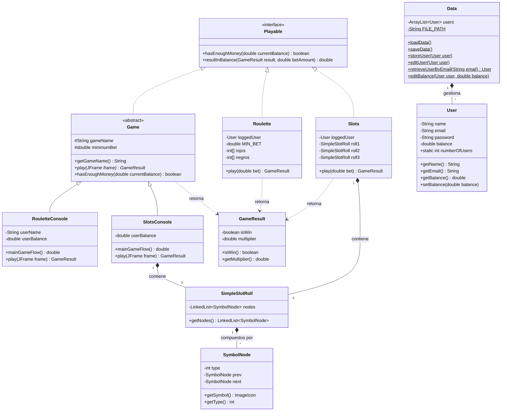

# Proyecto Casino Virtual

## 1. Descripción General
El **Casino Virtual** es una aplicación de escritorio escrita en Java que simula un casino con Slots traga monedas y una Ruleta. El propósito del desarrollo del programa fue aplicar los principios de la Programación Orientada a Objetos (POO).

El sistema incluye gestión de usuarios con persistencia de datos, manejo de saldos monetarios y dos juegos de azar totalmente funcionales: Ruleta Europea y Máquina Tragamonedas (Slots).

---

## 2. Requisitos del Sistema
Para el correcto funcionamiento y compilación del proyecto en el entorno de desarrollo, se requiere:
* **Java Development Kit (JDK):** Versión 17, 21 o superior.
* **Entorno de Desarrollo (IDE):** IntelliJ IDEA (Recomendado).
* **Dependencias Externas:** Es obligatorio enlazar la librería `AbsoluteLayout-SNAPSHOT.jar` (ubicada en la carpeta `lib/`) en el `classpath` del proyecto.

---

## 3. Arquitectura del Proyecto
El programa está estructurado de manera modular para separar la lógica de negocio, la gestión de datos y la interfaz gráfica.

### 3.1. Paquetes Principales (`base.*`)
* **`accountsHandler`**: Contiene la lógica de autenticación (Login, Registro), la estructura del usuario (`User.java`) y el gestor de persistencia (`Data.java`). Además, maneja las excepciones personalizadas (`DuplicateUserException`, `IncompleteUserDataException`).
* **`mainProgram`**: Núcleo principal de navegación de la aplicación (`Home`, `Main`, `Payment`, `ModifyUserData`).
* **`mainProgram.Games`**: Define la abstracción de los juegos mediante la clase abstracta `Game.java` y la interfaz `Playable.java`.
* **`mainProgram.Games.Roulette`**: Lógica e interfaz gráfica del juego de ruleta (`Roulette.java`, `RouletteConsole.java`, animaciones e inputs).
* **`mainProgram.Games.Slots`**: Lógica e interfaz del tragamonedas. Incorpora componentes personalizados de UI como `RollPanel.java` para aparentar el giro de los rodillos.

---

## 4. Gestión de Usuarios y Persistencia
* **Archivo de datos:** El estado de los usuarios se guarda localmente en `casino_users.dat`.
* **Clase `User`**: Cada usuario almacena su nombre, correo (identificador único), contraseña y balance actual (`wallet`).
* **Operaciones soportadas:** Creación de cuenta, validación de credenciales, recarga de saldo y modificación de datos de perfil.

---

## 5. Juegos Implementados

Los juegos utilizan herencia y polimorfismo. Todos los juegos extienden la clase abstracta `Game` e implementan la interfaz `Playable`, esto hace que métodos como `play()` y el cálculo de pagos (`resultInBalance`) estén estandarizados.

### 5.1. Ruleta Europea (`Roulette`)
Simula una ruleta de 37 casillas (0 al 36).
* **GUI Interactivo:** Una mesa de apuestas interactiva (`AbsoluteLayout`) y animación por temporizadores (`javax.swing.Timer`) que rota la rueda (`RotatedIcon`) y traslada la bola.
* **Tipos de Apuestas Soportadas y Multiplicadores:**
  * **Pleno (1 número):** Paga 35 a 1.
  * **Split (2 números):** Paga 17 a 1.
  * **Street (3 números):** Paga 11 a 1.
  * **Square / Esquina (4 números):** Paga 8 a 1.
  * **Línea / Seisena (6 números):** Paga 5 a 1.
  * **Docenas y Columnas (12 números):** Paga 2 a 1.
  * **Suertes Sencillas (Color, Par/Impar, Altos/Bajos):** Paga 1 a 1.

### 5.2. Tragamonedas (`Slots`)
Simula una máquina clásica de 3 rodillos.
* **Mecánica:** Utiliza listas enlazadas simples (`SimpleSlotRoll`) para definir el orden de los símbolos.
* **Animación:** Los rodillos (`RollPanel`) giran utilizando de forma asíncrona hasta detenerse en el símbolo evaluado por el sistema.
* **Multiplicadores:** Los premios se otorgan si los 3 rodillos coinciden.
  * Cerezas (`Cherry`): Paga 3 a 1.
  * Limones (`Lemon`): Paga 9 a 1.
  * Campanas (`Bell`): Paga 24 a 1.
  * Sietes (`Seven`): Paga 199 a 1 (Jackpot).

---

## 6. Guía de Ejecución

El programa fue diseñado para ser ejecutado bajo dos modalidades según las preferencias del entorno:

### Opción A: Modo Gráfico (GUI - Swing)
1. Navegar hasta el archivo `src/main/java/base/Main.java`.
2. Compilar y ejecutar (`Run Main.main()`).
3. Esto abrirá la ventana de bienvenida que permite navegar fluidamente utilizando los botones gráficos e interactuar visualmente con las mesas de juego.

### Opción B: Modo Consola (Terminal)
1. Navegar hasta el archivo `src/main/java/base/MainConsole.java`.
2. Compilar y ejecutar.
3. El sistema solicitará ingresos por teclado (`Scanner`) para la navegación por menús numéricos, logueo y la inserción de apuestas.

---

## 7. Patrones y Buenas Prácticas Aplicadas
* **Encapsulamiento y Abstracción:** Lógica de apuestas separada de las clases UI.
* **Polimorfismo:** Diferentes juegos responden a las mismas interfaces para cobro y ejecución.
* **Manejo de Excepciones:** Controles tipo `try-catch` para evitar cierres inseperados por `NumberFormatException` y una capa de persistencia.
* **Animación basada en Eventos:** Uso de `java.awt.event.ActionListener` y Temporizadores para renderizar los juegos sin bloquear el hilo principal (Event Dispatch Thread).

## 8. Diagrama UML

